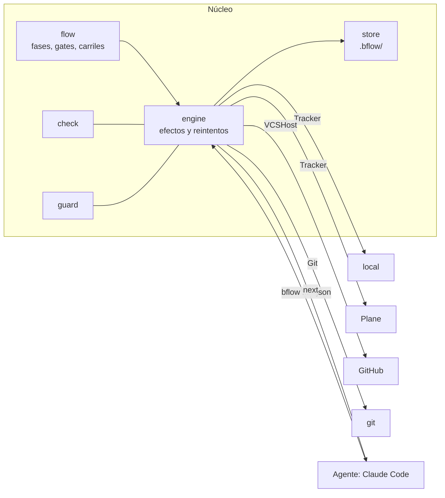
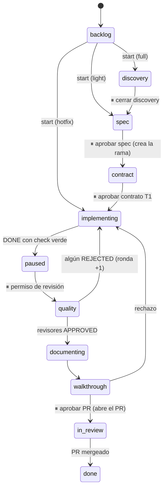

# Byteflow · `bflow`

**Motor de flujo Spec-Driven Development para trabajar con agentes de IA.** Un solo binario en Go que lleva cada tarea de la idea al PR mergeado (discovery, spec, contrato, implementación, revisión, walkthrough), decide las transiciones, habla con tu tracker y con git, y le dice al agente exactamente qué hacer después, en pocas líneas de JSON.

> Estado: **MVP**. Funciona de punta a punta con el tracker local, Plane y GitHub, y con Claude Code como agente. La API de comandos puede cambiar antes de la 1.0.

---

## Por qué existe

Trabajar con agentes de IA en proyectos reales suele terminar en un *harness*: un conjunto de prompts, subagentes y scripts que describen el proceso ("primero pregunta, luego escribe la spec, no edites pruebas, pide revisión…"). Nosotros tuvimos uno en dos repos, uno de backend y otro de frontend, y los problemas eran siempre los mismos:

- **Las reglas vivían en prosa.** "OBLIGATORIO", "NUNCA", "no saltes la compuerta". El modelo las respetaba casi siempre, y justo ese "casi" es donde se cuelan los errores caros.
- **El modelo movía el estado a mano.** Cambiaba estados en el tracker, creaba ramas y armaba URLs de PR, cada vez a su manera. En un repo el flujo estaba validado por scripts; en el otro, no.
- **Gastaba tokens en trabajo mecánico.** Leer el tracker, releer bitácoras, interpretar la salida de 4 comandos de pruebas, mantener archivos de estado. En uno de los repos, unos 7.000 tokens fijos por sesión antes de hacer nada útil.
- **Llenaba el repo de estado de trabajo.** Entre el 73% y el 80% de los archivos del harness versionados eran bitácoras, reportes y estado, no especificaciones.
- **Cada repo tenía su copia.** Mantenerlas sincronizadas era tedioso y se desviaban: estados distintos, prefijos de rama distintos, reglas que un repo tenía y el otro no.

Byteflow separa lo que **requiere criterio** (entender el problema, diseñar, programar, revisar), que hace el agente, de lo que es **determinista** (estado, transiciones, git, tracker, pruebas, reglas), que hace el CLI. El agente no tiene que recordar el proceso: pregunta a `bflow` qué sigue y lo hace.

## Qué hace

- **Máquina de estados con gates humanos.** Cada tarea recorre fases; en los puntos de decisión (aprobar la spec, aprobar el contrato, aprobar el PR…) el flujo se detiene hasta que una persona decide.
- **Carriles.** Una feature normal (`full`), una pequeña (`light`) o un defecto ya mergeado (`hotfix`) recorren fases distintas. Ninguno se salta la revisión de calidad.
- **`next`: una sola instrucción para el agente.** Cada comando responde qué preguntar (con las opciones y el comando exacto de cada una), qué agentes lanzar (con sus argumentos y cómo deben reportar), qué esperar o que no hay nada pendiente.
- **Tracker y git sin el modelo.** Mueve la tarea en el tracker, sella la fecha de inicio, comenta los rechazos, crea la rama al aprobar la spec, abre el PR con el review-map y el walkthrough, y cierra la tarea cuando el PR se mergea.
- **Compuerta de calidad determinista (`bflow check`).** Corre los pasos del proyecto (lint, pruebas, build, vulnerabilidades, secretos), resume los fallos en pocas líneas y liga el resultado a un commit. El agente no puede reportar "terminé" sin un check verde del código actual.
- **Reglas que se cumplen con código (`bflow guard`).** Un hook bloquea antes de que ocurra: `git reset --hard`, push forzado o a ramas protegidas, editar `.env` o `.bflow/`, modificar las pruebas que se aprobaron en el contrato y, con una tarea en curso, crear ramas o PRs a mano (eso lo hace bflow). Las pruebas congeladas también se verifican sin hook: `report DONE` y `check --verify` comparan su contenido con el del contrato, y solo una persona acepta un cambio con `bflow freeze`.
- **Métricas.** Tiempo por fase separado en trabajo del agente, espera del humano y bloqueo; iteraciones (rechazos por gate, rondas, decisiones); hotfixes ligados a la feature que corrigen (`start --fixes`); fricción (pedidos que el flujo rechazó y bloqueos de `guard`), y tokens por fase y por modelo leídos de los transcripts del agente.
- **Salida pensada para gastar pocos tokens.** JSON compacto y sin campos redundantes. Una respuesta típica pesa ~480 bytes, y un check fallido le entrega al agente solo las líneas de fallo, sin repetir; el detalle completo queda en un archivo.

## Cómo funciona

### Núcleo neutral y adaptadores

El núcleo solo conoce conceptos propios: tarea, fase, gate, carril, veredicto y comentario en Markdown. Todo lo externo es un adaptador que traduce. Una prueba de arquitectura falla si algún paquete del núcleo importa un adaptador.



| Eje | Hoy | Previsto |
|---|---|---|
| Tracker | `local` (archivos en el repo, sin cuenta), Plane | Jira, Linear, GitHub Issues, Notion |
| Repositorio y PR | GitHub (sin token, deja la URL de compare y la descripción lista) | GitLab, Gitea |
| Agente | Claude Code | Codex, OpenCode |
| Stack | Go, Angular, Node (defaults de check y rutas de código) | otros |

### Fases



`⏸` marca un gate humano. Cualquier fase puede pasar a `blocked` y volver a donde estaba. Si la revisión de calidad rechaza dos rondas seguidas, `bflow` pregunta si dividir la feature, volver a spec o hacer otra ronda. Nadie marca `done` a mano: se cierra al detectar el merge.

| Carril | Fases |
|---|---|
| `full` | discovery → spec → contract → implementing → paused → quality → documenting → walkthrough → in_review → done |
| `light` | spec → implementing → quality → documenting → walkthrough → in_review → done |
| `hotfix` | implementing → quality → documenting → walkthrough → in_review → done |

### El contrato con el agente: `next`

Todo comando acepta `--json` y responde con el mismo envelope. Los códigos de salida son `0` si todo salió bien, `1` si hubo un error y `2` si fue un rechazo del flujo (por ejemplo, aprobar algo que no está pendiente).

```json
{"ok":true,"code":"advanced","data":{"id":"API-12","phase":"spec"},
 "next":{"action":"ask","gate":"spec","skill":"approve",
   "show":["bflow show API-12 brief"],
   "question":"¿Apruebas el spec?",
   "options":[
     {"id":"approve","label":"Aprobar","command":"bflow approve API-12 --gate spec"},
     {"id":"changes","label":"Pedir cambios puntuales","needs_note":true,
      "command":"bflow reject API-12 --gate spec --note \"<motivo>\""}]}}
```

La sesión principal del agente solo interpreta `next`:

- `ask`: muestra lo que indica `show`, pregunta al humano y ejecuta el comando de la opción elegida.
- `spawn`: lanza los subagentes con sus argumentos. Cada uno reporta con `bflow report`.
- `wait`: explica qué se espera.
- `done`: no hay nada pendiente.

Ningún subagente le pregunta nada al humano: devuelve su veredicto y `bflow` decide.

### Qué queda en el repo y qué no

- **En el repo:** solo `specs/<ID>-<slug>/spec.md`, con encabezados fijos (brief, discovery, requirements, design, tasks y ui-blueprint si el stack tiene UI). `bflow show <ID> spec --section design` corta por encabezado para que el agente lea solo lo que necesita.
- **En la descripción del PR:** el review-map, el walkthrough, las decisiones tomadas en vuelo y el contrato para los equipos que consumen el cambio.
- **En el tracker:** el discovery completo, los rechazos y los recordatorios de gates que llevan más de 24 horas esperando.
- **En `.bflow/`,** que se ignora sola en git: el estado de cada tarea, `log.jsonl`, el contrato, los reportes y el resultado del check.

## Instalación

Requiere Go 1.25 o superior (los binarios firmados llegarán con las primeras releases).

```bash
go install innobytes.tech/bflow/cmd/bflow@latest
```

O desde el código:

```bash
git clone https://github.com/innobytestech/bflow.git
cd bflow
go install ./cmd/bflow
```

Comprueba que quedó en tu `PATH`:

```bash
bflow version
```

Se instala una vez por máquina. Cada repo solo necesita un `bflow.yaml` corto; nunca se copia código de bflow al repo.

## Inicio rápido

### 1. Configurar un repo

```bash
cd mi-repo
bflow init           # detecta stack, remoto, rama base y propone los pasos de check
bflow doctor         # valida config, herramientas, conexiones y hooks
```

`bflow init` pregunta solo lo que no pudo detectar; con `--yes` no pregunta nada. Sin `bflow.yaml`, bflow funciona con el tracker local y solo con git.

### 2. Recorrer una tarea (tracker local)

```bash
bflow task add "Validación de RFC en el alta de clientes"   # crea LOCAL-1
bflow start LOCAL-1 --lane light
bflow report LOCAL-1 --agent spec-author --verdict READY    # lo corre el agente
bflow show LOCAL-1 brief
bflow approve LOCAL-1                                        # crea la rama
# ... el implementer programa y corre `bflow check` ...
bflow report LOCAL-1 --agent implementer --verdict DONE     # con pasos de check, exige un check verde
bflow status
```

Cada comando imprime el siguiente paso. Con `--json`, ese paso llega en `next`.

### 3. Conectar Plane y GitHub (opcional)

```bash
bflow connect plane --url https://plane.example.com --workspace mi-workspace
bflow connect github --from-gh      # o --token
bflow tracker states                # cómo se traducen las fases a tus estados
bflow tracker setup --dry-run       # qué estados faltarían crear
```

Los tokens se validan antes de guardarse en el llavero del sistema (Credential Manager, Keychain o Secret Service) y nunca se escriben en YAML. En CI se usan variables de entorno: `BFLOW_PLANE_TOKEN`, `GH_TOKEN`.

### 4. Usarlo con Claude Code

Copia los archivos de [`adapters/claude/`](adapters/claude/):

| Archivo | Destino |
|---|---|
| `skills/bflow/SKILL.md` | `~/.claude/skills/bflow/SKILL.md` (una vez por máquina) |
| `settings.json` | `<repo>/.claude/settings.json` |

La skill tiene unas 30 líneas: no contiene reglas del flujo, solo cómo interpretar `next`. Los hooks corren `bflow hook session-start` al abrir la sesión, `bflow guard` antes de cada edición o comando, `bflow hook tokens` al terminar cada turno y la barra de estado con `bflow statusline`:

```
API-12 · implementing · 1h42m · ronda 1 · 184k tok
```

## Configuración

Hay tres capas; la última gana:

1. **Global** (`~/.config/bflow/config.yaml`, en Windows `%AppData%\bflow\config.yaml`), con perfiles compartidos entre repos.
2. **Perfil**, el que cada repo referencia.
3. **Repo** (`bflow.yaml`), solo con lo propio de ese repo.

```yaml
# global (bflow profile add acme --tracker plane --url ... --host github --base dev)
profiles:
  acme:
    tracker: { adapter: plane, url: https://plane.example.com, workspace: acme }
    vcs: { host: github, base_branch: dev }
    agent: claude
```

```yaml
# bflow.yaml del repo (lo genera bflow init)
profile: acme
stack: go
tracker: { project: API }        # identificador legible, nunca UUID
check:
  steps:
    - { name: vet,   run: "go vet ./..." }
    - { name: test,  run: "go test -count=1 {race} ./..." }
    - { name: lint,  run: "golangci-lint run --new-from-rev={base}", needs: golangci-lint }
    - { name: vulns, run: "govulncheck ./...", needs: govulncheck, optional: true }
```

La validación junta todos los problemas en un solo mensaje, indica la línea de los campos desconocidos y rechaza cualquier clave que parezca un secreto.

## Comandos

| Grupo | Comandos |
|---|---|
| Flujo | `status [ID] [--brief]` · `start <ID> --lane [--fixes ID]` · `approve` · `reject --note` · `report --agent --verdict` · `block` / `unblock` · `freeze` · `show` · `task add` · `sync` · `import --from harness` |
| Git y PR | `pr` · `panel [--sla]` (cierra lo mergeado, recuerda gates vencidos) |
| Calidad | `check [--quick pkg] [--verify]` · `env check` · `guard` |
| Métricas | `stats [ID]` · `statusline` · `watch` |
| Configuración | `init` · `doctor` · `connect plane\|github` · `profile add\|list\|use` · `tracker setup` · `tracker states` |
| Hooks | `hook session-start` · `hook tokens` |

`bflow help` lista todo; cualquier comando acepta `--json`.

## Estado y hoja de ruta

El MVP cubre el módulo 1 (motor de flujo) y adelanta las guardas y las métricas:

1. ✅ Motor de flujo: estado, gates, tracker local y Plane, git y GitHub.
2. ✅ Guardas (versión inicial): git destructivo, `.env`, pruebas congeladas, tamaño de diff.
3. ⏳ Distribuidor: una sola definición de agentes (`agents.yaml`) y `bflow render --tool claude|codex|opencode`, `bflow update`, binarios firmados.
4. ✅ Métricas: tiempo y tokens por fase.
5. ⏳ Contexto: índice del código para el planner y el reviewer.
6. ⏳ Planeación: ordenar el backlog y repartirlo en ciclos balanceados.

## Desarrollo

```bash
go vet ./...
go test ./...        # incluye E2E que compilan el binario y usan git real
```

- Dependencias: biblioteca estándar, `gopkg.in/yaml.v3` y `github.com/zalando/go-keyring`.
- El núcleo (`internal/...`) nunca importa `internal/adapters/...`; lo verifica `internal/archtest`. El único lugar que conecta ambos es `cmd/bflow`.
- Los adaptadores externos se prueban con `httptest` y respuestas grabadas, nunca contra servicios reales.
- Guía para contribuir: [`CONTRIBUTING.md`](CONTRIBUTING.md). Vulnerabilidades: [`SECURITY.md`](SECURITY.md).

## Licencia

[Apache License 2.0](LICENSE). Copyright 2026 Innobytes ([innobytes.tech](https://innobytes.tech)).
