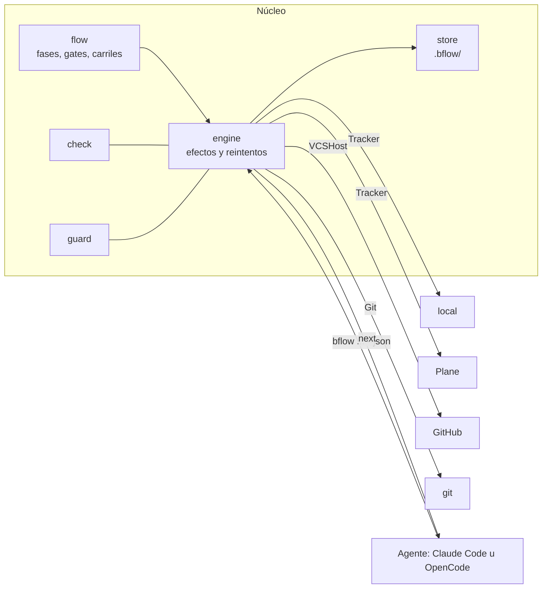
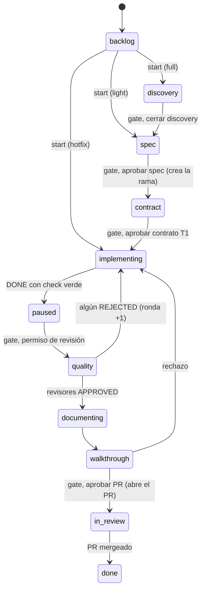

# Conceptos

bflow separa lo que **requiere criterio** (entender el problema, diseñar, programar, revisar), que hace el agente, de lo que es **determinista** (estado, transiciones, git, tracker, pruebas, reglas), que hace el CLI. El porqué está en [por-que-y-rumbo.md](por-que-y-rumbo.md); el día a día, en la [guía](guia.md).

## Qué hace

- **Máquina de estados con gates humanos.** Cada tarea recorre fases; en los puntos de decisión (aprobar la spec, aprobar el contrato, aprobar el PR…) el flujo se detiene hasta que una persona decide.
- **Carriles.** Una feature normal (`full`), una pequeña (`light`) o un defecto ya mergeado (`hotfix`) recorren fases distintas. Ninguno se salta la revisión de calidad.
- **`next`: una sola instrucción para el agente.** Cada comando responde qué preguntar (con las opciones y el comando exacto de cada una), qué agentes lanzar (con sus argumentos y cómo deben reportar), qué esperar o que no hay nada pendiente.
- **Tracker y git sin el modelo.** Mueve la tarea en el tracker, sella la fecha de inicio, comenta los rechazos, crea la rama al aprobar la spec, abre el PR con el review-map y el walkthrough, y cierra la tarea cuando el PR se mergea.
- **Compuerta de calidad determinista (`bflow check`).** Corre los pasos del proyecto (lint, pruebas, build, vulnerabilidades, secretos), resume los fallos en pocas líneas y liga el resultado a un commit. El agente no puede reportar "terminé" sin un check verde del código actual.
- **Reglas que se cumplen con código (`bflow guard`).** Un hook bloquea antes de que ocurra: `git reset --hard`, push forzado o a ramas protegidas, editar `.env` o `.bflow/`, modificar las pruebas que se aprobaron en el contrato, que un subagente apruebe, rechace, desbloquee o empiece tareas (eso lo responde una persona) y, con una tarea en curso, crear ramas o PR a mano (eso lo hace bflow). Las pruebas congeladas también se verifican sin hook: `report DONE` y `check --verify` comparan su contenido con el del contrato, y solo una persona acepta un cambio con `bflow freeze`.
- **Métricas.** Tiempo por fase separado en trabajo del agente, espera del humano y bloqueo; iteraciones (rechazos por gate, rondas, decisiones); hotfixes ligados a la feature que corrigen (`start --fixes`); fricción (pedidos que el flujo rechazó y bloqueos de `guard`), y tokens por fase, por agente y por modelo leídos de los transcripts, con lo nuevo separado de la caché leída. Cómo se reparten los tokens entre tareas: [marcas-sesion.md](marcas-sesion.md).
- **Salida pensada para gastar pocos tokens.** JSON compacto y sin campos redundantes. Una respuesta típica pesa ~480 bytes, y un check fallido le entrega al agente solo las líneas de fallo, sin repetir; el detalle completo queda en un archivo.

## Núcleo neutral y adaptadores

El núcleo solo conoce conceptos propios: tarea, fase, gate, carril, veredicto y comentario en Markdown. Todo lo externo es un adaptador que traduce. Una prueba de arquitectura falla si algún paquete del núcleo importa un adaptador.



| Eje | Hoy | Previsto |
|---|---|---|
| Tracker | `local` (archivos en el repo, sin cuenta), Plane, GitHub Issues y Projects | Jira, Linear, Notion |
| Repositorio y PR | GitHub (sin token, deja la URL de compare y la descripción lista) | GitLab, Gitea |
| Agente | Claude Code y OpenCode (agentes, comando `/bflow` y plugin con guard y tokens) | Codex |
| Stack | Go, Angular, Node (defaults de check y rutas de código) | otros |

## Fases y carriles



Las transiciones marcadas "gate" son humanas. Cualquier fase puede pasar a `blocked` y volver a donde estaba. Si la revisión de calidad rechaza dos rondas seguidas, `bflow` pregunta si dividir la feature, volver a spec o hacer otra ronda. Nadie marca `done` a mano: se cierra al detectar el merge. Una tarea también puede pasar a `dropped` (retirada sin terminar) desde cualquier fase de trabajo con `bflow drop`, o automáticamente cuando se aprueba un split que crea tareas hijas.

| Carril | Fases |
|---|---|
| `full` | discovery, spec, contract, implementing, paused, quality, documenting, walkthrough, in_review, done |
| `light` | spec, implementing, quality, documenting, walkthrough, in_review, done |
| `hotfix` | implementing, quality, documenting, walkthrough, in_review, done |

## Gates

Una gate es un punto donde el flujo se detiene hasta que una persona decide: carril, discovery, spec, contrato T1, decisiones que un agente no puede tomar, pausa antes de la revisión, rondas, preguntas de producto y walkthrough. Qué ves y qué decides en cada una está en la [guía](guia.md#las-gates-qué-ves-y-qué-decides).

## El contrato con el agente: `next`

Todo comando acepta `--json` y responde con el mismo envelope. Los códigos de salida son `0` si todo salió bien, `1` si hubo un error y `2` si fue un rechazo del flujo (por ejemplo, aprobar algo que no está pendiente).

```json
{"ok":true,"code":"advanced","data":{"id":"API-12","phase":"spec"},
 "next":{"action":"ask","gate":"spec","skill":"approve",
   "show":["bflow show API-12 brief"],
   "question":"¿Apruebas el spec?",
   "options":[
     {"id":"approve","label":"Aprobar","command":"bflow approve API-12 --gate spec"},
     {"id":"changes","label":"Pedir cambios puntuales","needs_note":true,
      "command":"bflow reject API-12 --gate spec --note \"<motivo>\""}]}}
```

La sesión principal del agente solo interpreta `next`:

- `ask`: muestra lo que indica `show`, pregunta al humano y ejecuta el comando de la opción elegida.
- `spawn`: lanza los subagentes con sus argumentos. Cada uno reporta con `bflow report`.
- `wait`: explica qué se espera.
- `done`: no hay nada pendiente.

Cuando una gate avanza la fase, `next` trae `clear: true` y la skill sugiere `/clear`: el hook de inicio devuelve el estado y el hilo no se pierde, porque vive en bflow y no en la conversación.

Ningún subagente le pregunta nada al humano: devuelve su veredicto y `bflow` decide.

## Qué queda en el repo y qué no

- **En el repo:** solo `specs/<ID>-<slug>/spec.md`, con encabezados fijos (brief, discovery, requirements, design, tasks y ui-blueprint si el stack tiene UI). `bflow show <ID> spec --section design` corta por encabezado para que el agente lea solo lo que necesita.
- **En la descripción del PR:** el review-map, el walkthrough, las decisiones tomadas en vuelo y el contrato para los equipos que consumen el cambio.
- **En el tracker:** el discovery completo, los rechazos y los recordatorios de gates que llevan más de 24 horas esperando.
- **En `.bflow/`,** que se ignora sola en git: el estado de cada tarea, `log.jsonl`, el contrato, los reportes y el resultado del check.

## Qué garantiza (y qué no)

Lo que vive en el CLI se cumple con cualquier herramienta. Lo que depende de hooks, solo donde hay hooks.

| Garantía | Claude Code con los hooks de bflow | OpenCode con el plugin de bflow | Sin hooks (otra herramienta) |
|---|---|---|---|
| El estado, las fases y las gates los maneja bflow, no el modelo | Sí | Sí | Sí |
| `DONE` exige un check verde sobre el commit actual | Sí | Sí | Sí |
| Las pruebas del contrato no cambian después de aprobarlo | Sí, se bloquea la edición y se revisa al reportar | Sí, se bloquea la edición y se revisa al reportar | Sí, se revisa al reportar |
| `git reset --hard`, push forzado o a ramas protegidas, `.env`, `.bflow/` | Sí, se bloquea antes de que ocurra | Sí, se bloquea antes de que ocurra (si `bflow` no está en el PATH el guard no actúa y el plugin avisa) | No |
| Ramas y PR solo los crea bflow mientras hay una tarea en curso | Sí | Sí | No |
| Un agente que termina sin reportar sigue trabajando (2 avisos, luego decide una persona) | Sí | No: OpenCode no tiene evento de fin de subagente; lo cubren `bflow report`, `bflow check --verify` y el bloque de AGENTS.md | No |
| El reviewer abrió los archivos de las viñetas rojas (decisiones) del diff antes de aprobar (si no, `review_incomplete`) | Sí, mide `Read` y Bash del reviewer en quality | Sí, el plugin manda `read` solo de la subsesión `bflow-reviewer` | No se mide y no se exige |
| Tokens por fase, agente y modelo | Sí | Sí | No (solo tiempos) |

**Lo que bflow no garantiza:**

- **La calidad del código.** La revisan los agentes de calidad y tú en el walkthrough; bflow asegura que esos pasos ocurran, no que acierten.
- **Que el agente siga su oficio.** Cómo programa o revisa está en prosa; bflow hace cumplir el contrato (qué reporta, qué archivos toca, cuándo puede decir DONE), no el estilo.
- **Contención ante un agente malintencionado.** `guard` es una barandilla contra errores comunes, no un sandbox: revisa comandos y rutas conocidos, y un comando rebuscado puede pasar.

Siguiente: [configuración](configuracion.md) · [comandos](comandos.md).
